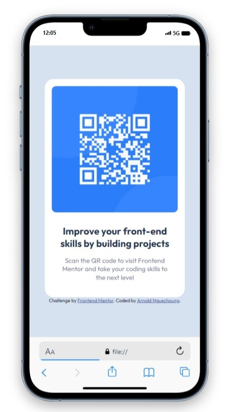
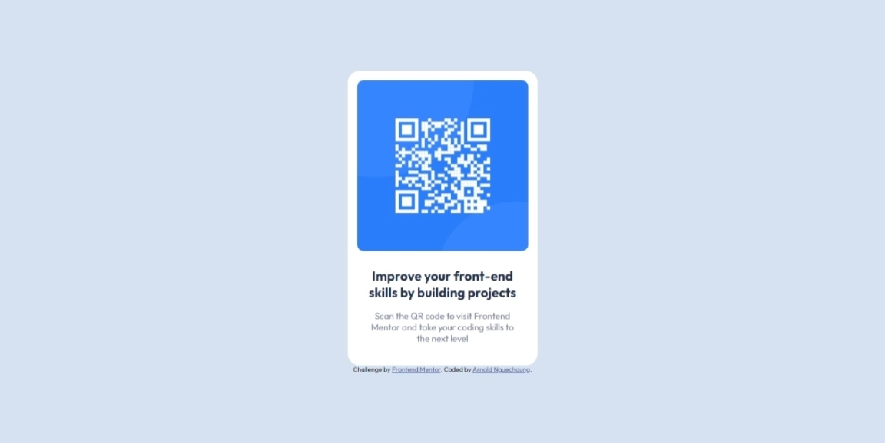

# Frontend Mentor - QR code component solution

This is a solution to the [QR code component challenge on Frontend Mentor](https://www.frontendmentor.io/challenges/qr-code-component-iux_sIO_H). Frontend Mentor challenges help you improve your coding skills by building realistic projects. 

## Table of contents

- [Overview](#overview)
  - [Screenshot](#screenshot)
  - [Links](#links)
- [My process](#my-process)
  - [Built with](#built-with)
  - [What I learned](#what-i-learned)
  - [Continued development](#continued-development)
  - [Useful resources](#useful-resources)
- [Author](#author)
- [Acknowledgments](#acknowledgments)


## Overview

### Screenshot




### Links
- Solution URL: [On github]([https://your-solution-url.com](https://github.com/escannord/qr-code-component-main))
- Live preview URL: [Live preview](https://your-live-site-url.com)

## My process

### Built with

- Semantic HTML5 markup
- CSS custom properties
- CSS Grid
- Mobile-first workflow
- google fonts family ``outfit``


### What I learned

I learned a lot from this challenge, particularly how to center content both vertically and horizontally thanks to the grid.

look at the code below 👇👇👇, it only took me 2 lines to center my content unlike flex boxes


```css
body {
	display: grid;
	place-items: center;
	background-color: hsl(212, 45%, 89%);
	height: 100vh;
	font-family: "Outfit", sans-serif;
}
```


### Continued development

I would like to easily have imagination for the design of my future web pages. create incredible designs in just a few lines of code.


### Useful resources

- [google fonts](https://fonts.googleapis.com) - This resource allowed me to find and adapt the appropriate font to my design.


## Author

- Website - [Arnold Nguechoung](https://github.com/escannord)
- Frontend Mentor - [@escannord](https://www.frontendmentor.io/profile/escannord)
- Twitter - [@ANguechoung](https://x.com/ANguechoung)

## Acknowledgments

I thank ``Frontend Mentor`` for allowing me to improve my skills as a web designer.

